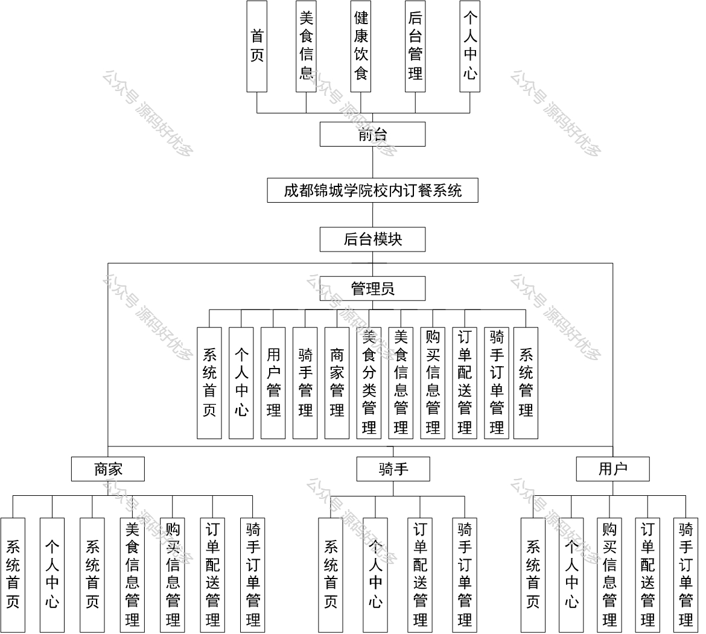
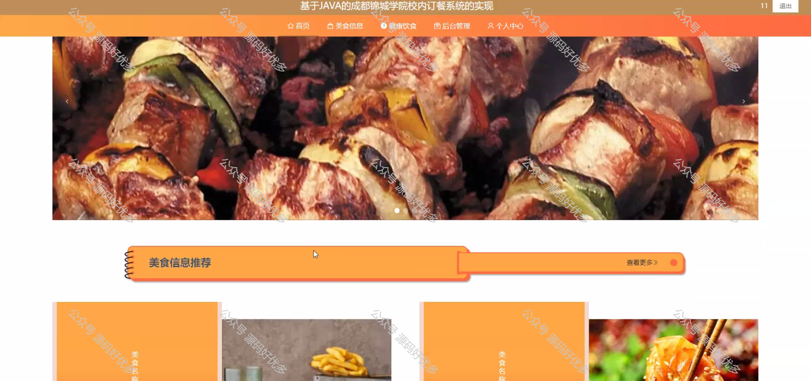
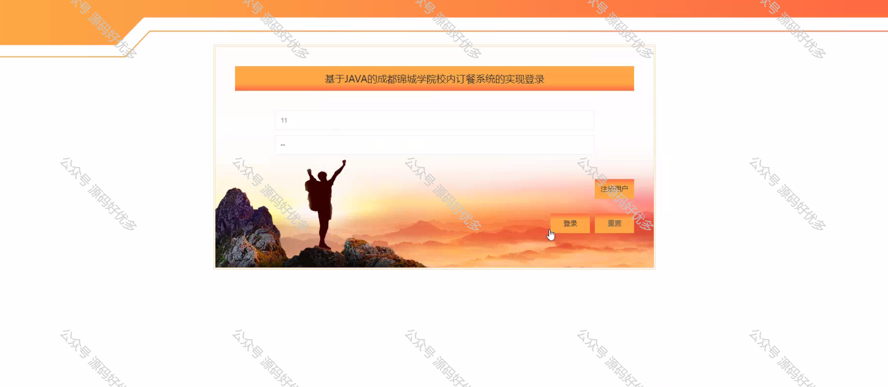
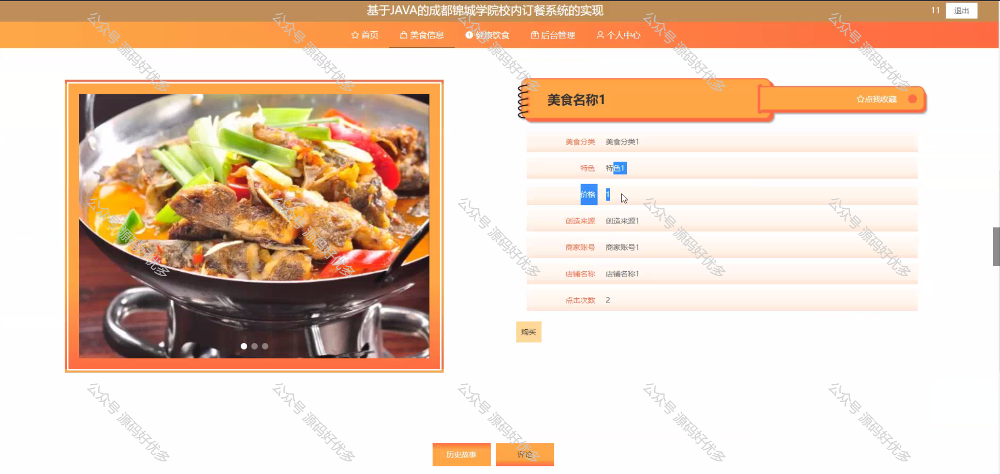
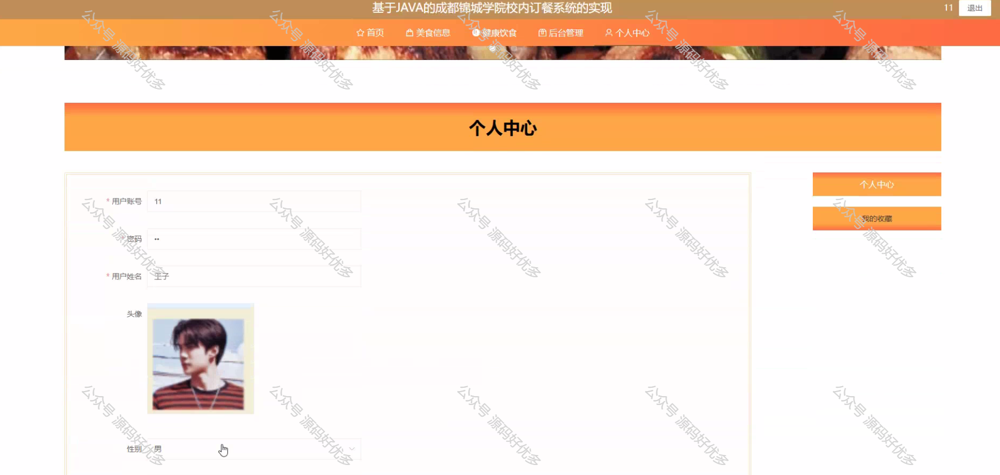
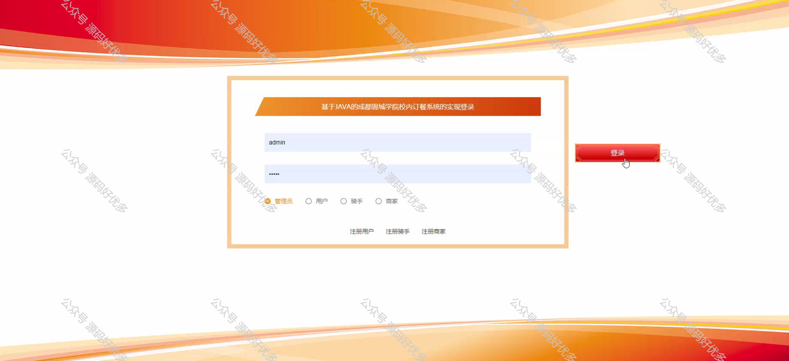
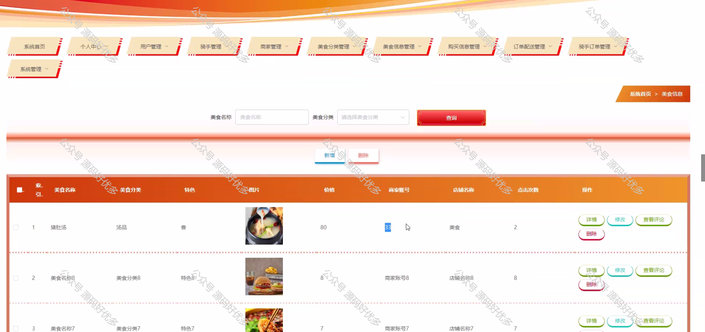
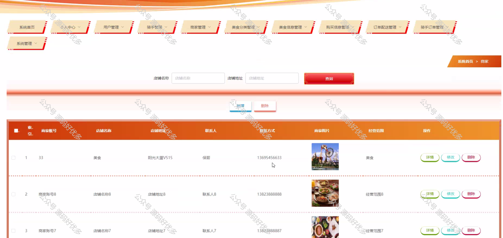
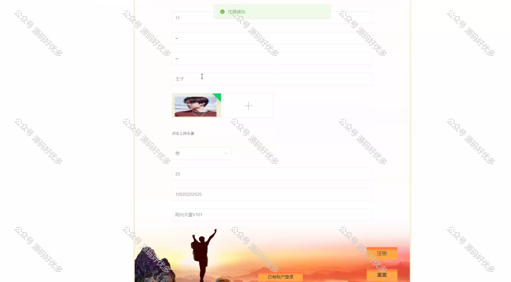
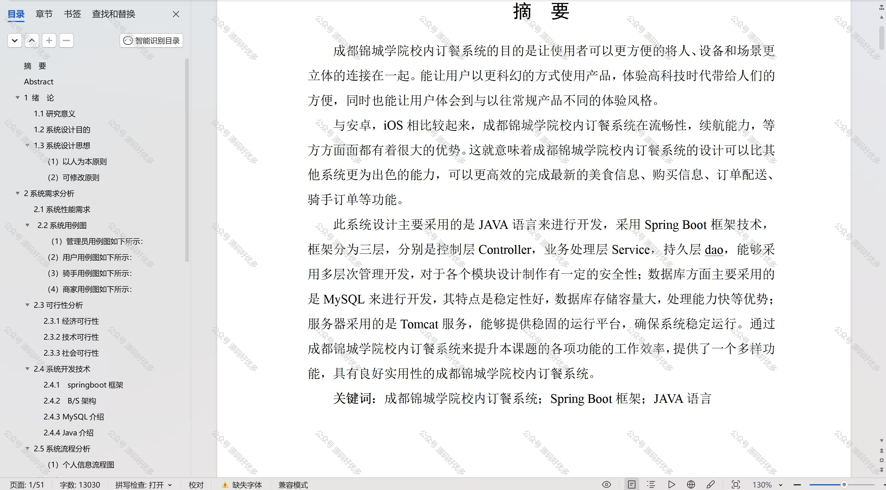

 
## 查看主页获取源码

### 一、作品包含

源码+数据库+设计文档万字+PPT+全套环境和工具资源+部署教程

### 二、项目技术

前端技术：Html、Css、Js、Vue、Element-ui

数据库：MySQL

后端技术：Java、Spring Boot、MyBatis

  

### 三、运行环境

开发工具：IDEA/eclipse

数据库：MySQL5.7

数据库管理工具：Navicat10以上版本

环境配置软件： JDK1.8+Maven3.6.3

前端Nodejs：14

### 四、项目介绍
项目编号：springbootA245

成都锦城学院校内订餐系统的推出，是为了满足校园内师生对于便捷、多样、安全的餐饮服务的需求，同时也是学院后勤服务现代化的重要组成部分。该系统通过与校园食堂及餐饮服务商的合作，旨在提供一个高效、卫生、可追溯的订餐平台，进一步提升校园生活的品质。

前台用户功能：首页、美食信息、健康饮食、后台管理、个人中心。

后台分为管理员、用户、商家、骑手
管理员的功能：系统首页、个人中心、用户管理、骑手管理、商家管理、美食分类管理、美食信息管理、购买信息管理、订单配送管理、骑手订单管理、系统管理。
用户的功能：系统首页、个人中心、购买信息管理、订单配送管理和骑手订单管理。
商家的功能：系统首页、个人中心、美食信息管理、购买信息管理、订单配送管理、骑手订单管理。
骑手的功能：系统首页、个人中心、订单配送管理、骑手订单管理。

### 五、运行截图

  

